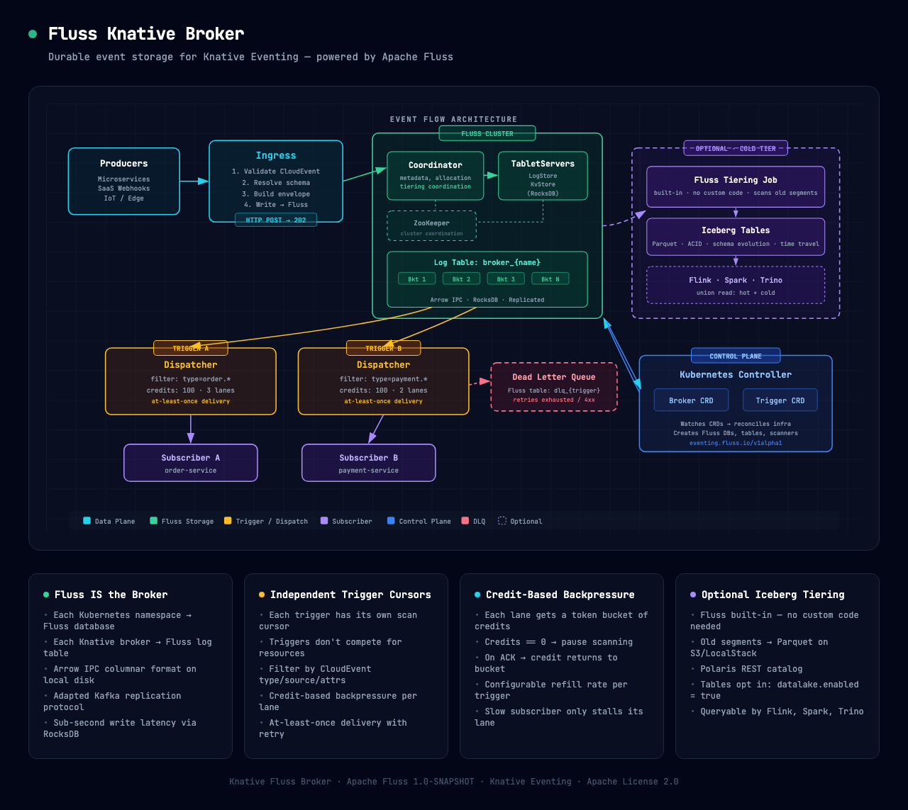

# Knative Fluss Broker

A Knative-native event broker backed by [Apache Fluss](https://fluss.apache.org/) for durable, low-latency event storage with optional Apache Iceberg lakehouse tiering.



## What Is This?

This project implements the [Knative Broker and Trigger](https://knative.dev/docs/eventing/) specification using Apache Fluss as the underlying storage engine. Events flow through a simple pipeline:

```
Producer → Ingress → Fluss Log Table → Trigger → Dispatcher → Subscriber
                                              ↘ DLQ (on failure)
                     Fluss Log Table ──→ Iceberg (cold tier, optional)
```

Fluss replaces Kafka as the broker backend, giving you:
- **Sub-second write latency** via RocksDB + Arrow IPC columnar storage
- **Independent trigger cursors** — each subscriber scans at its own pace
- **Credit-based backpressure** — slow subscribers don't stall the system
- **Built-in Iceberg tiering** — optional cold storage for analytics, no custom code

## Quick Start

```bash
# Build
./gradlew build

# Run tests
make test              # Unit tests (~15s)
make test-integration  # Integration tests with docker-compose Fluss
make test-e2e          # End-to-end data plane + Iceberg tiering tests
make test-e2e-k8s      # Full K8s e2e (Kind + Knative + Fluss Helm)

# Docker infrastructure
make docker-up              # Basic Fluss cluster
make docker-up-lakehouse    # Full lakehouse: Fluss + Flink + LocalStack + Polaris
make docker-down            # Tear down containers + volumes
```

> **E2E tests** require `make docker-up-lakehouse` first — they ingest CloudEvents, verify Fluss persistence, tier to Iceberg via the native tiering job, and query back with both union reads and `$lake`.

## How It Works

**Data Plane** (event path):

1. **Ingress** accepts CloudEvents via HTTP, validates them, resolves schemas, and writes envelopes to Fluss
2. **Fluss Log Table** stores events durably in Arrow IPC format on local disk (RocksDB for key lookups)
3. **Triggers** define filters on CloudEvent attributes (`type=order.created`) and bind to subscriber URIs
4. **Dispatchers** scan the log table per-trigger with independent cursors, deliver via HTTP with credit-based backpressure and at-least-once retry
5. **Dead Letter Queue** catches poison messages after retries are exhausted

**Control Plane** (Kubernetes):

- `Broker` CRD (`eventing.fluss.io/v1alpha1`) — defines a Fluss-backed event namespace
- `Trigger` CRD — binds a filter + subscriber to a Broker
- Controller watches both CRDs and reconciles Fluss infrastructure (databases, tables, scanners)

**Iceberg Tiering** (optional):

- Fluss 1.0-SNAPSHOT native tiering job (`fluss-flink-tiering`) scans old log segments and writes Parquet to S3/LocalStack
- Configured via `datalake.*` server properties — tables opt in with `table.datalake.enabled = 'true'`
- Polaris REST catalog for Iceberg metadata (Apache Polaris 1.3.0-incubating, no Hive Metastore needed)
- Plugins: `fluss-fs-s3` + `fluss-lake-iceberg` in `FLUSS_HOME/plugins/`
- **Union reads** work for log tables (append-only): a regular query transparently merges Fluss hot data + Iceberg cold data into a single result set
- `$lake` system table reads from Iceberg only (e.g. `SELECT * FROM broker_test$lake`)
- Readable by Flink, Spark, and Trino

## Project Structure

```
data-plane/
  common/          Shared models, CloudEvent envelope, config records
  ingress/         HTTP ingress handler
  dispatcher/      Per-trigger dispatcher with backpressure
  storage-fluss/   Fluss client and table management
  schema/          Schema registry and validation
  delivery/        HTTP delivery and retry tracking

control-plane/
  api/             CRD models (Broker, Trigger)
  controller/      Kubernetes reconcilers

docker/            Docker Compose + Dockerfile + init scripts
config/            CRD YAML, K8s manifests, sample resources
hack/              Kind cluster scripts, Helm values
test/              Testcontainers, WireMock, integration, e2e, perf
docs/              Architecture, ADRs, runbooks, diagrams
```

## Prerequisites

- Java 21
- Docker + Docker Compose
- `kubectl`, `kind`, `helm` (for K8s e2e tests)

## Documentation

| Topic | Link |
|-------|------|
| Architecture overview | [docs/architecture/overview.md](docs/architecture/overview.md) |
| Data plane design | [docs/architecture/data-plane.md](docs/architecture/data-plane.md) |
| Control plane design | [docs/architecture/control-plane.md](docs/architecture/control-plane.md) |
| Backpressure dispatcher | [docs/architecture/backpressure-dispatcher.md](docs/architecture/backpressure-dispatcher.md) |
| Iceberg tiering | [docs/architecture/iceberg-tiering.md](docs/architecture/iceberg-tiering.md) |
| Test strategy | [docs/testing/test-strategy.md](docs/testing/test-strategy.md) |
| Local development | [docs/runbooks/local-dev.md](docs/runbooks/local-dev.md) |
| Architecture decisions | [docs/adr/](docs/adr/) |

### Diagrams

Interactive SVG diagrams (open in any browser):

- [Fluss as Knative Broker — Event Flow](docs/diagrams/fluss-knative-broker.html)
- [Streaming Lakehouse — Three-Tier Storage](docs/diagrams/streaming-lakehouse.html)
- [Test Harness Deployment](docs/diagrams/test-harness-deployment.html)
- [Apache Fluss Internals](docs/diagrams/fluss-internals.html)

## License

Apache License 2.0
